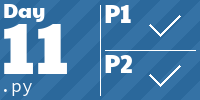

# Advent of Code
My solutions for [Advent of Code](https://adventofcode.com/2022) in 2022. Probably done mostly in Python 3.11 🐍.

- `solutions/` contain the source files to solve the problem, one for each day. Ideally executable to print both results. Keep in mind they are _cleaned_ solutions.
- `utils/` hande logging, caching, helping, submitting and are cloned from the amazing [mebeim/aoc/utils/](https://github.com/mebeim/aoc/tree/master/utils). Licensed under the Apache License 2.0.

<!-- AOC TILES BEGIN -->
<h1 align="center">
  2022 - 30 ⭐
</h1>

<!-- AOC TILES END -->
